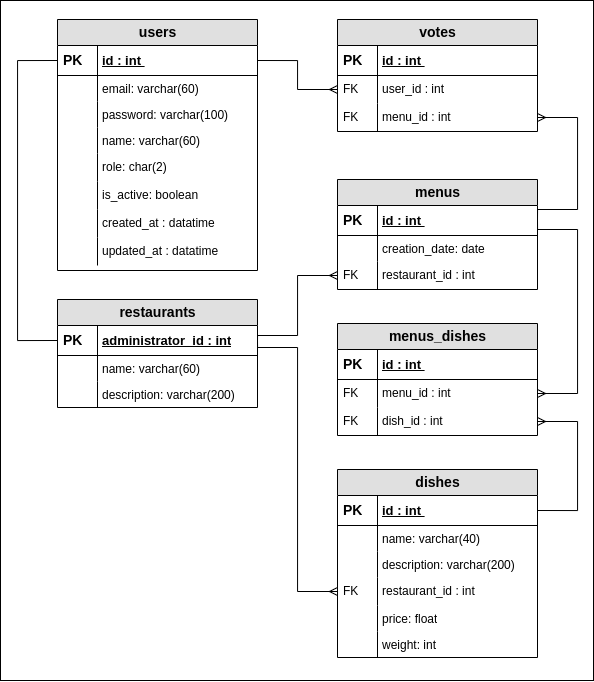

# Where To Go Today
<h3>Description</h3>
This is a simple service for the company's employees where restaurants can register and provide their daily lunch menus and employees can vote for the restaurant which they want to visit today

<h3>Database scheme</h3>

<h3>Requirements</h3>
Before running the application on your machine you need to have docker and docker-compose installed. 
The installation guide you can find <a href="https://docs.docker.com/desktop/">here</a>.
 Also you need to add .env and .env.db file to the root directory of the project.
Example of .env file:
<pre>
<code><b>
TIME_ZONE=Europe/Kiev #your timezone
DEBUG=True 
SECRET_KEY='django-insecure-&31'
MOBILE_APP_VERSION=8.25.0 #actual version of the mobile app which uses this rest api</b></code>
</pre>
Example of .env.db file:
<pre>
<code><b>
POSTGRES_DB=wtgt_db
POSTGRES_USER=postgres
POSTGRES_PASSWORD=1111
POSTGRES_HOST=wtgt_database #this parameter must be the same because it refers to the docker container where the database will be running
POSTGRES_PORT=5432</b></code>
</pre>

<h3>How to run</h3>
To run application and its database in docker containers (you can add <code><b>-d</b></code> flag to run them in background)
<pre>
<code><b>docker-compose up </b></code>
</pre>
To stop and remove the docker containers where the application and its database run
<pre>
<code><b>docker-compose down</b></code>
</pre>
To have an access to the all function the system you need to create a superuser (admin), run the following command 
(<code><b>container_id</b></code> - the id of the container where the application runs):
<pre>
<code><b>docker exec -it container_id python manage.py createsuperuser </b></code>
</pre>
And then enter user email and password

