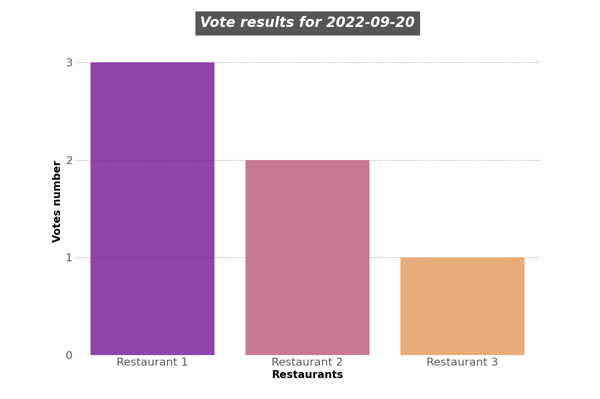

# Where To Go Today
<h3>Description</h3>
This is a simple service for the company's employees where restaurants can register and provide their daily 
lunch menus and employees can vote for the restaurant which they want to visit today
 
In this app exists the following types of users (admin, employee, restaurant_admin).
Users are authenticated to the system using a password and email. User authorization is 
implemented on the basis of roles. Registration in the system is available to anyone, upon 
registration you need to specify the role of the new user (restaurant_admin, employee by 
default). But the new accounts are not active, they can be activated only by the admin after 
conducting the necessary checks.
 
An ordinary employee can only view the restaurant menus available today. He can vote for a menu only once 
a day, there is a possibility to delete his vote and vote for another menu. He can also view the results 
of today's votes from the menu.
 
The restaurant _admin can create only one restaurant for which he is responsible, add, edit, delete dishes 
that will belong to this restaurant, and add only one menu daily that includes previously added dishes. 
Also, if necessary, he can remove his establishment from the system.
 
The admin has full access to all system functions, except for creating a new restaurant.
 
An example of versioning is implemented for the <code><b>/restaurants/menus/vote-results</b></code> endpoint. 
From this endpoint, you can get the result in two different forms according to the version 
of the mobile application that uses this rest api. The current version of the mobile 
application is stored in a environment variable.
 
If the version of the mobile application with which the user works is older than the 
current one, then he will receive the result of voting for the menu in the form of a .png 
file, if the version is current, then the result will be in JSON format.
Example in JSON format:
<pre>
<code><b>
[
    {
        "restaurant": {
            "id": 8,
            "name": "Restaurant 1"
        },
        "votes_number": 3
    },
    {
        "restaurant": {
            "id": 9,
            "name": "Restaurant 2"
        },
        "votes_number": 2
    },
    {
        "restaurant": {
            "id": 13,
            "name": "Restaurant 3"
        },
        "votes_number": 1
    }
]
</b></code>
</pre>
Example in .png format:

<h3>Used technologies</h3>
<dl>
  <li>Django + Django REST Framework</li>
  <li>Simple JWT</li>
  <li>PostgreSQL</li>
  <li>Docker + Docker Compose</li>
  <li>Pytest + Coverage</li>
</dl>

<h3>Database scheme</h3>

<h3>Requirements</h3>
Before running the application on your machine you need to have docker and docker-compose installed. 
The installation guide you can find <a href="https://docs.docker.com/desktop/">here</a>.
 Also you need to add .env and .env.db file to the root directory of the project.
Example of .env file:
<pre>
<code><b>
TIME_ZONE=Europe/Kiev #your timezone
DEBUG=True 
SECRET_KEY='django-insecure-&31'
MOBILE_APP_VERSION=8.25.0 #actual version of the mobile app which uses this rest api</b></code>
</pre>
Example of .env.db file:
<pre>
<code><b>
POSTGRES_DB=wtgt_db
POSTGRES_USER=postgres
POSTGRES_PASSWORD=1111
POSTGRES_HOST=wtgt_database #this parameter must be the same because it refers to the docker container where the database will be running
POSTGRES_PORT=5432</b></code>
</pre>

<h3>How to run</h3>
To run application and its database in docker containers (you can add <code><b>-d</b></code> flag to run them in background)
<pre>
<code><b>docker-compose up </b></code>
</pre>
To stop and remove the docker containers where the application and its database run
<pre>
<code><b>docker-compose down</b></code>
</pre>
To have an access to the all function the system you need to create a superuser (admin), run the following command 
(<code><b>container_id</b></code> - the id of the container where the application runs):
<pre>
<code><b>docker exec -it container_id python manage.py createsuperuser </b></code>
</pre>
And then enter user email and password

